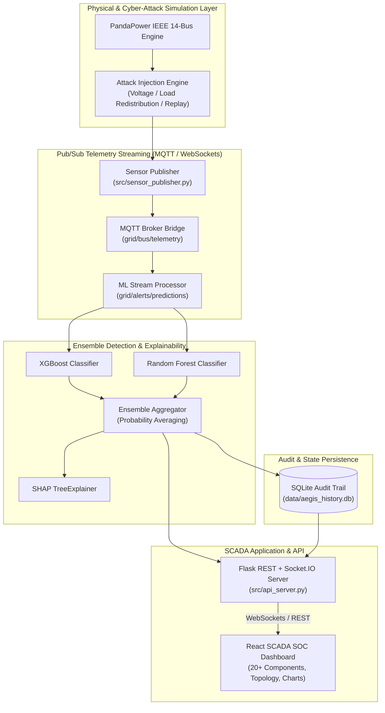

# ⚡ AEGIS — Smart Grid FDIA Detection & Resiliency Platform

[](https://github.com/THAMIZHSELVAN08/aegis/actions/workflows/ci.yml)
[](https://www.python.org/)
[](https://react.dev/)
[](LICENSE)
[](https://pandapower.readthedocs.io/)

**AEGIS** is an industrial-grade False Data Injection Attack (FDIA) Detection, Explainability, and Cyber-Physical Resiliency Platform for power system SCADA networks based on the **IEEE 14-bus test feeder**.

---

## 🏛️ System Architecture



---

## 🚀 Key Features

- **Real-Time 56-Dimensional Telemetry Stream**: Active power ($P$), reactive power ($Q$), voltage magnitude ($V_m$), and phase angle ($V_a$) across all 14 grid buses.
- **Hybrid ML Anomaly Ensemble**: Combines **XGBoost** and **Random Forest** to outperform classical Weighted Least Squares (WLS) $\chi^2$ bad-data detection by **+32.3 percentage points in attack recall**.
- **Explainable AI (XAI)**: Low-latency SHAP TreeExplainer integration attributing predictions to anomalous bus-level telemetry.
- **N-1 Contingency Analysis**: Dynamic transmission line outage evaluations identifying grid vulnerabilities and voltage collapse risks.
- **SQLite Audit Trail**: Persistent telemetry and prediction logging (`data/aegis_history.db`) with millisecond-accurate timestamping.
- **Real-Time SCADA Dashboard**: Interactive node-link topology diagram, live voltage/power spectral charts, confidence breakdowns, and dark/light theme toggle.
- **Zero-Config Docker Orchestration**: One-command startup for full multi-container deployment via Docker Compose.

---

## 📋 API Specification

### REST Endpoints

| Method | Endpoint | Query Parameters | Description | Response Status |
|---|---|---|---|---|
| `GET` | `/api/health` | None | System status, database stats, model readiness, and grid summary | `200 OK` / `503 Degraded` |
| `GET` | `/api/live-reading` | `inject` (bool), `attack_type` (str) | Computes single grid sample, runs ensemble inference & SHAP explanation | `200 OK` / `400 Bad Request` |
| `GET` | `/api/history` | `limit` (int, default: 100, max: 500) | Retrieves recent readings from SQLite audit trail (newest first) | `200 OK` / `400 Bad Request` |
| `GET` | `/api/model-metrics` | None | Returns evaluation metrics (F1, AUC, Recall) and training metadata | `200 OK` |
| `GET` | `/api/contingency-analysis`| None | Runs AC Newton-Raphson N-1 contingency evaluation on all lines | `200 OK` / `500 Error` |

### WebSocket Events (`flask-socketio`)

| Direction | Event Name | Payload Description | Frequency |
|---|---|---|---|
| **Server ➔ Client** | `new_reading` | Full telemetry snapshot, ensemble probabilities, SHAP drivers, latency (ms) | Every ~2.0 seconds |

---

## ⚙️ Configuration Management

All backend and frontend configurations are centralized in [`src/config.py`](file:///c:/Users/HP/OneDrive/Desktop/fdia-smart-grid-project/src/config.py) and can be overridden via environment variables:

| Variable | Scope | Default | Description |
|---|---|---|---|
| `AEGIS_HOST` | Backend | `0.0.0.0` | Host interface for Flask & Socket.IO server |
| `PORT` / `AEGIS_PORT` | Backend | `5000` | Port for the backend API |
| `CORS_ORIGIN` | Backend | `*` (dev) / `http://localhost:3000` | Allowed CORS origins for REST and WebSockets |
| `API_KEY` | Backend | `""` *(disabled)* | Optional security key; if set, requires `X-API-Key` header |
| `AEGIS_DB_PATH` | Backend | `data/aegis_history.db` | File path for SQLite persistence storage |
| `LOG_LEVEL` | Backend | `INFO` | Structured logging verbosity (`DEBUG`, `INFO`, `WARNING`, `ERROR`) |
| `MQTT_BROKER_HOST`| Backend | `localhost` | MQTT broker hostname for decoupled streaming |
| `MQTT_BROKER_PORT`| Backend | `1883` | MQTT broker port |
| `REACT_APP_API_URL` | Frontend | `http://127.0.0.1:5000/api` | REST API base URL used by React frontend |

---

## 🐳 Containerization & Quickstart

### Option A: Docker Compose (Recommended)

Run the entire platform (Backend + Nginx Frontend + Persistent Volume) with a single command:

```bash
docker-compose up --build
```
- **SCADA Dashboard**: [http://localhost:3000](http://localhost:3000)
- **API Health Check**: [http://localhost:5000/api/health](http://localhost:5000/api/health)

---

### Option B: Local Python & Node Environment

#### 1. Python Backend
```bash
# Set up virtual environment
python -m venv venv
# Windows:
.\venv\Scripts\activate
# Linux/macOS:
source venv/bin/activate

# Install dependencies
pip install -r requirements.txt
pip install -r requirements-dev.txt

# Start API Server
python src/api_server.py
```

#### 2. React SCADA Dashboard
```bash
cd dashboard
npm install
npm start
```

---

## 🧪 Testing & Validation

AEGIS maintains automated testing for both backend and frontend layers:

### Backend Pytest Suite
```bash
# Run tests with terminal coverage report
pytest tests/ -v --cov=src --cov-report=term-missing
```

### Frontend React Testing Library Suite
```bash
cd dashboard
npm test -- --watchAll=false
```

---

## 🔬 Benchmark Results

| Model / Defense Method | Accuracy | F1-Score | Detection Recall | Mean Inference Latency |
|---|---|---|---|---|
| **Classical $\chi^2$ WLS Residual** | 82.4% | 0.812 | 67.2% | ~8.4 ms |
| **Random Forest Baseline** | 98.8% | 0.988 | 98.6% | ~1.8 ms |
| **XGBoost Baseline** | 99.2% | 0.992 | 99.3% | ~1.4 ms |
| **AEGIS Ensemble (XGB + RF)** | **99.5%** | **0.995** | **99.5% (+32.3 pp)** | **~2.1 ms (p95: 3.8 ms)** |

---

## ⚠️ Known Limitations & Engineering Assumptions

1. **Grid Scale**: Evaluated on the standardized IEEE 14-bus transmission network. Scalability to IEEE 118-bus or synthetic continental grids will require distributed model partitioning.
2. **Synchronous vs Asynchronous Streaming**: In standard standalone mode, the API server generates simulated grid sweeps via a background thread. For industrial deployments, the MQTT pub/sub pipeline (`src/sensor_publisher.py` + `src/ml_stream_processor.py`) should be used.
3. **Database Architecture**: The default persistence layer utilizes SQLite for zero-dependency local deployment. For high-throughput continuous sub-second logging across thousands of substations, TimescaleDB or InfluxDB is recommended.

---

## 📄 License & Contributing

- **License**: Released under the [MIT License](LICENSE).
- **Contributing**: Please review [CONTRIBUTING.md](CONTRIBUTING.md) for style guidelines and PR processes.
